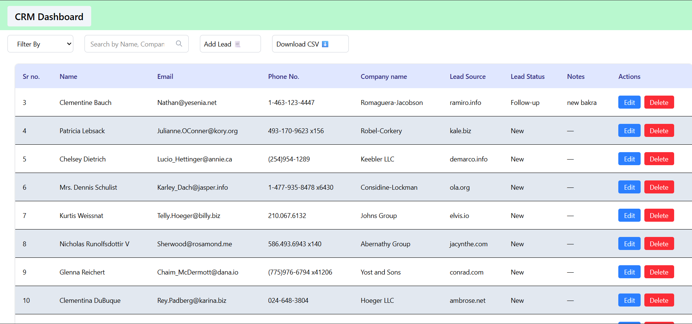
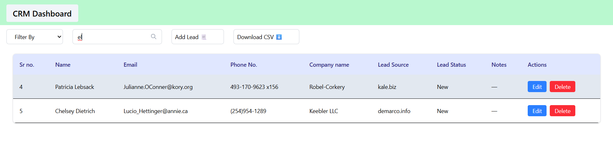
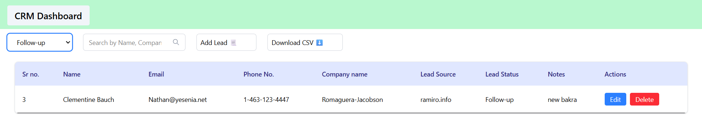
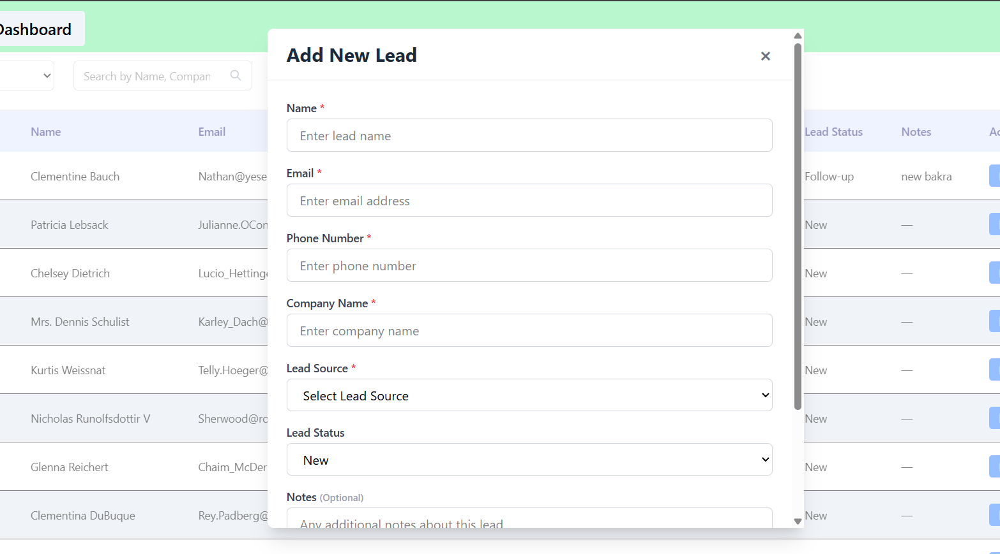
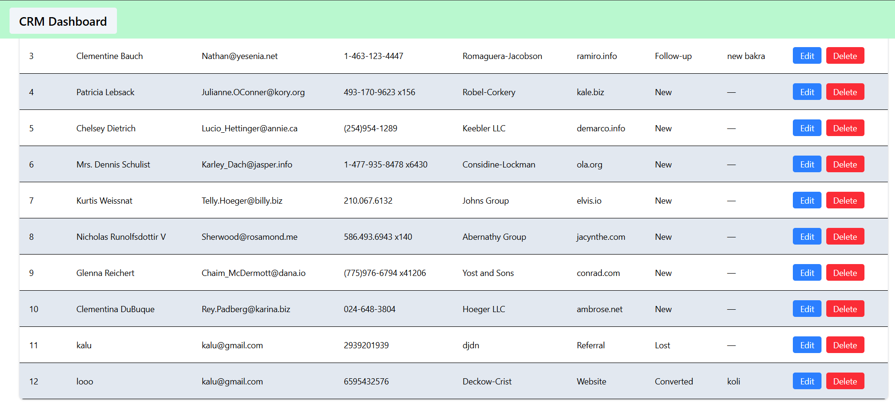

# CRM (Customer Relationship Management) System

## Project Overview

A React-based Lead Management application that allows users to manage sales leads efficiently. The app fetches an initial list of leads from a public API, and supports full CRUD operations with persistent state across page refreshes via localStorage.

---

## Features Implemented

- **View Leads** — Displays all leads in a structured table with Sr. No., Name, Email, Phone, Company, Lead Source, Status, Notes, and Actions
- **Add Lead** — Form with validation to add new leads (Name, Email, Phone, Company, Lead Source, Lead Status, and optional Notes)
- **Edit Lead** —  row editing with save functionality
- **Delete Lead** — Remove a lead from the list
- **Search** — Filter leads in real-time by Name or Company name
- **Filter by Status** — Dropdown to filter leads by Lead Status (New, Contacted, Follow-up, Converted, Lost)
- **Change Lead Status** — Update status per lead from the edit row
- **Download CSV** — Export currently filtered leads as a `.csv` file
- **Persistent State** — Leads data, search value, and filter state are saved to `localStorage` and restored on page refresh
- **Notes** — Optional notes field per lead, viewable and editable

---

## Tech Stack

| Technology | Purpose |
|---|---|
| React 19 | UI library |
| Vite | Build tool and dev server |
| Tailwind CSS v4 | Styling |
| Axios | API requests |
| localStorage | Client-side persistence |
| React.memo / useMemo / useCallback | Performance optimisation |

---

## Setup Instructions

1. **Clone the repository**
   ```bash
   git clone <repository-url>
   cd jobaajassignment
   ```

2. **Install dependencies**
   ```bash
   npm install
   ```

3. **Start the development server**
   ```bash
   npm run dev
   ```

4. **Open in browser**
   ```
   http://localhost:5173
   ```

5. **Build for production**
   ```bash
   npm run build
   ```

---

## Screenshots






